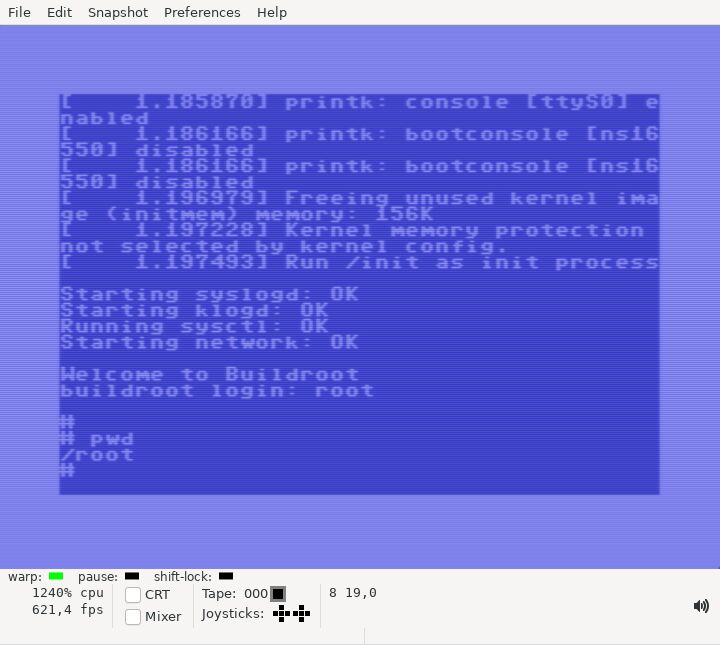
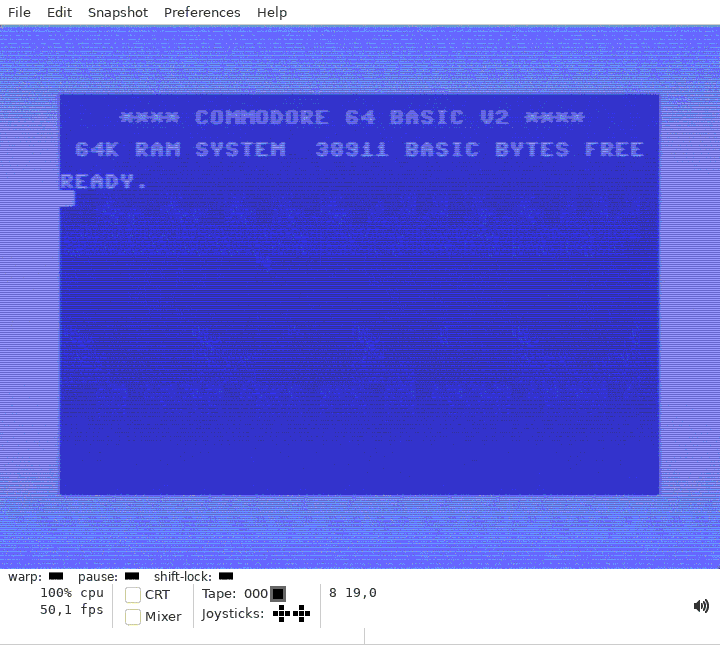

# Running Linux on a Commodore C-64

"But does it run Linux?" can now be finally and affirmatively answered
for the Commodore C64!

There is a catch (rather: a couple) of course: It runs *extremely*
slowly and it needs a RAM Expansion Unit (REU), as there is no chance
to fit it all into just 64KiB.

It even emulates virtual memory with an MMU.

# ChangeLog / Updates

## Aug 31th 2023, Persistence (quickly load a booted Linux)

I added simple persistence to the emulator so it is possible to
"quickly" (ahem) *run* Linux on your C-64.

The emulator can load the RISC-V CPU registers (plus the other HW, UART
and interrupt controller) from REU address 0xfff000. Which is behind the
initcramfs image and should not interfere with anything else. (Yes, this
is not really a nice way to do it, but it works for now ...)

I'll add a release "v0.0.2booted" or so (see 'Releases' to the right)
which will have the emulator to load from saved state plus the REU
image that has Linux pre-booted in it.

Otherwise, the Linux kernel and userland is exactly the same, the only
difference is that the state of the emulator has advanced to just
before the colon of the prompt "buildroot login:".

In other words, when you load and start this file with semu, there
should be a a single ':' appearing relatively quickly. You need to enter
'root' there and should be logged in, just like before.

It also allows to do another cross-check between the PC and the C-64
variant of semu - to check that the generated REU files after booting
and persisting the emulator state are the same, including the state of
the CPU and peripherals.

## Aug 31th 2023, First real boot!

Thanks to emulaThor on Youtube,
[@hpingel](https://www.github.com/hpingel) on github, a real C-64 has
now successfully booted for the first time:

https://www.youtube.com/watch?v=TN9zf7wd3VI

Congratulations, so you are likely the first person on the planet to
have ever booted Linux on a real C-64! :-)

There is still a minor problem, though: There was a kernel-oops
printed on the C-64. I have not seen that in testing with
Vice/kernalemu, so I *suspect* it was just a random bit flip, an
energetic particle hitting a transistor gate in the CPU or somewhere
at the wrong moment or similar. It could, of course, also be a bug in
the emulator. If I understand it correctly,
[@hpingel](https://www.github.com/hpingel) had been parallel booting
the code on other C-64 models as well, and those crashed earlier,
likely for similar reasons. Without any input on the keyboard, the
emulated boot process should be fully deterministic.

The C-64 took about 150 billion 6510 cycles with ~8bits of activity
each cycle to get to this point, so the bit error rate of the system
needs to be <<1e-12 to not have any bit flips anywhere. Which is
probably not very easy given the old hardware and the long runtimes.

So ... the title of "First person successfully booting Linux on a C-64 and
entering a shell without any crashes" is still up for the taking :D

## Aug 30th 2023, Boot times

To know what to expect when on real hardware, this [annotated boot
log](boot_times.md) (from an emulator run on PC) might be helpful.

I uploaded my fork of
[`kernalemu`](https://github.com/onnokort/kernalemu) for easier
testing of `semu-c64`.

## Aug 28th 2023, Optimizations!

First of all, I like to correct a mistake: The measurement of 300
RISCV32-Mcycles of boot time which I stated on reddit is rather
inaccurate. I measured it by a simple manual checking when to stop the
emulation (with a limit on the `vm.insn_count` variable) and checked
it to "about when I could successfully login" with the PC build of the
simulator. That is, of course, more than just "boot time" and also
includes actual run time after boot and I underestimated the time it
ran still after boot this way. IOW, I didn't intend to throw
dirt onto Linux :D

I have changed the code now to optionally enable a stop when the
string `buildroot login:` is encountered on the simulated UART. This
is of course, not really an elegant way to do it, but it works and it
gives 100% repeated cycle count numbers when the boot process is
emulated on the PC. I really like `semu` as an emulator (and have other
ideas what one could do to with it which are more practically
oriented), however there is a lot of additional tooling which could be
implemented around it.

Measuring the new way, I now get:
`
VM RISCV insn count: 137085690
`

for the "v0.0.1 release" (LOL), so 140Mcycles. With enabling `cramfs`
(and I hope also with XIP, though one should check that), this melts
down considerably, to:

`
VM RISCV insn count: 94748399
`

about 95Mcycles which is a nice 30% improvement on the 'guest
side'. With the rough cycle count ratio which I posted on reddit of
about 1500 6510 ticks for each RISCV32 instruction, boot time with the
V0.0.1 `semu` and the new kernel on a real C64 should now be close to
142.5ksec, or 1.65 days.

Then, I further set the compiler flag `-O3` instead of `-Os`, which
surprisingly also does what one expect even for `llvm-mos`, and I got
another improvement of about 5.3% runtime on the emulator side, albeit
with a considerable code size increase.

This reduces further by about 4.2% using a recent git of `llvm-mos`
where the author fixed a subexpression elimination bug when doing bit
shifts on long words (which the emulator does - a lot).

A further nice ~3.9% improvement could be had by moving key emulator
variables to the zero page. But this means that the codebase can not
be easily kept in sync with upstream anymore, for the time being, I'll
push that to a branch named `hackopt`.

I believe these are about the lowest hanging fruit there are to get
the figures better, but pull requests are welcome of course. Taken
together, this should speed up everything to about 59% of V0.0.1 with
V0.0.2 now, or about 1d 10.5h.

I further noticed during tests that my MMU cache implementation
ironically does not really work for the C64 (though was inspired by
it), as `llvm` seems to miss a few key cross-function
optimizations. So this needs improvement and the C-64 is now stuck at
the adhoc single-level MMU-lookup cache for fetch, store, load that it
already has.

Note further that, though I have checked the initial release to run
through to the prompt on Vice, though might not do this for the sake
of my own sanity for each and every release I post here. Consider all
of them highly experimental and not fit for production work ;-) Edit:
I have now checked v0.0.2 though, and it boots (in Vice, Alt-W...).

# Building it

Just use `make`. You need [`mos-c64-clang`](https://github.com/llvm-mos/).

Change the single `C64` variable at the top of the Makefile and you should be able to switch between a `x86_64` and an `llvm-mos-6502` build of the code.

The notes from the [original README](README.original.md) apply for the most part. The kernel configuration is different, though, as the kernel from the original `semu` is too bloated with huge section alignments. A more fitting kernel configuration can be found in the `config` subfolder. Finally, to assemble it all into the REU image needed for the VICE emulator, use the `mk_linux_reu.py` script. It still uses the original `initrd` image, as that works just well.

# Running it

To run it, simply create a `.d64` file containing the compiled `semu` executable (or simply select the correct path for a virtual disk drive in the emulator). Then (in VICE EMU), go to Preferences | Settings | Cartridges | RAM Expansion Module, enable it and select the file `reufile.linux`, and make sure to select the correct size (16MiB) as well. If you started `x64` from the console, a message that it loaded successfully should appear.

Then, do `LOAD "SEMU",8,1` and `run` and ... *wait* ... (hours!). With "warp mode" enabled in the emulator, the first boot messages should appear within a few minutes, though.

You can also use the PC `semu` binary with the `-k` option to load the reufile.linux into the PC emulator and you should get a 100% identical boot sequence, as everything should be deterministic until the first keypress.

I plan to add an archive with all the neccessary premade binaries as soon as I figured out how to do that on github. Look for something on the "Releases" tab.

# Further notes

- The screenshots took VICE *a couple hours* in "warp mode" (activate it with Alt-W) to generate. So, as is, a real C64 should be able to boot Linux within a week or so.

- The compiled 6502 code is not really optimized yet, and it might be realistic to squeeze a factor 10x of performance out of this. Maybe even a simple form of JIT compilation? It should also be possible to implement starting a checkpointed VM (quickly precomputed on `x86-64`) to avoid the lengthy boot process. Maybe `X` on an emulated framebuffer device in 320x200 graphics mode? VIC-II DRI? :D

- I also tested a minimal micropython port (I can clean it up and post it on github if there is interest), that one does not use the MMU and is almost barely remotely usable with lots of optimism at 100% speed...

- The generated `semu` executable is a generic RISCV32 emulator and it simply assumes that the REU maps to the address range 0x00000000 .. 0x01000000. You should be able to compile any (embedded, bare-bones) RISCV32 executable that uses just the emulated UART, fill it up to a size of 16MiB, load it as a REU-image into VICE and run it using the same `semu` 6510 binary.

- Likewise, I made a simple [kernalemu](https://github.com/mist64/kernalemu) fork with "REU support" which seems to run a lot faster than Vice.

- The emulated UART does upper-/lowercase PETSCII<->ASCII translation. That could use a lot of improvement, though ...

# Thanks

This is in essence a fork of the very nicely minimalist RISC-V32 emulator named [semu](https://github.com/sysprog21/semu), compiled and ported using the new [llvm-mos](https://github.com/llvm-mos/) and would not have been possible without all that previous work.

# (Boot animation)

Time not to scale.
